# Informe General de Aseguramiento de Calidad: Calculadora de Descuentos

**Elaborado por:** Equipo de Desarrollo (Desarrollador & Antigravity)  
**Fecha de emision:** 20 de mayo de 2026  
**Proyecto:** Calculadora de Descuentos con Pruebas Automatizadas  
**Repositorio Oficial:** [Jhonmavisoy/Calculadora-Descuento](https://github.com/Jhonmavisoy/Calculadora-Descuento)  

---

## 📋 1. Introduccion y Requerimientos de la Calculadora

Este proyecto consiste en una **Calculadora de Descuentos** interactiva (`calculadora.py`) programada en Python. Su objetivo es calcular cuanto debe pagar un cliente despues de aplicar un descuento. 

Para asegurar que los calculos sean 100% correctos y que el sistema no se caiga ante errores de los usuarios, se diseñaron pruebas bajo los siguientes requerimientos de negocio:
*   **R1 (Limite de Descuento):** El descuento debe estar estrictamente entre 0% y 100%. Si se ingresa un porcentaje menor a 0 o mayor a 100, la calculadora debe bloquear el calculo.
*   **R2 (Limite de Precio):** El precio original de los productos debe ser mayor a $0. No se permiten precios negativos ni productos gratis ($0).
*   **R3 (Descuento Estandar):** El calculo basico debe restar el porcentaje indicado (ej. un 20% de descuento a un producto de $100 nos da $80).
*   **R4 (Redondeo Preciso):** El precio final cobrado debe redondearse automaticamente a dos decimales (ej. $42.97) para evitar errores con los centavos.
*   **R5 (Super Promocion):** Si se aplica un descuento muy alto (de 80% o mas), el sistema le regala al cliente un **5% de descuento adicional acumulado** sobre lo restante.
*   **R6 (Soporte Decimal):** La calculadora debe permitir decimales tanto en los precios como en los porcentajes de descuento.

### Ecosistema de Herramientas Usadas:
*   **Python:** Lenguaje principal de programacion.
*   **Pytest:** Framework para escribir y ejecutar pruebas unitarias de forma rapida y parametrizada.
*   **Unittest:** Libreria estandar de pruebas de Python para validacion tradicional basada en clases.
*   **Faker:** Generacion pseudoaleatoria de datos de compra para estresar el sistema.
*   **Coverage.py:** Herramienta que mide que tanto codigo esta cubierto y protegido por las pruebas.
*   **Git & GitHub:** Control de versiones en la nube y repositorio de codigo.
*   **GitHub Actions:** Pipeline de CI/CD para la ejecucion automatica de pruebas tras cada push.

---

## 🧪 2. Pruebas Automatizadas con Pytest

**Pytest** es la herramienta moderna elegida para automatizar gran parte de los examenes. Mediante el uso de la palabra clave `assert` y la decoracion `@pytest.mark.parametrize`, se simplifica el codigo de pruebas y se ejecutan multiples casos con diferentes entradas en cuestion de milisegundos.

Diseñamos una suite centralizada (`test_calculadora_pytest.py`) que evalua **14 casos distintos** de limites y comportamiento del negocio.

### 📸 Evidencia 2.1: Primera Prueba Basica
Validacion inicial del entorno de Pytest comunicandose con el modulo de la calculadora.
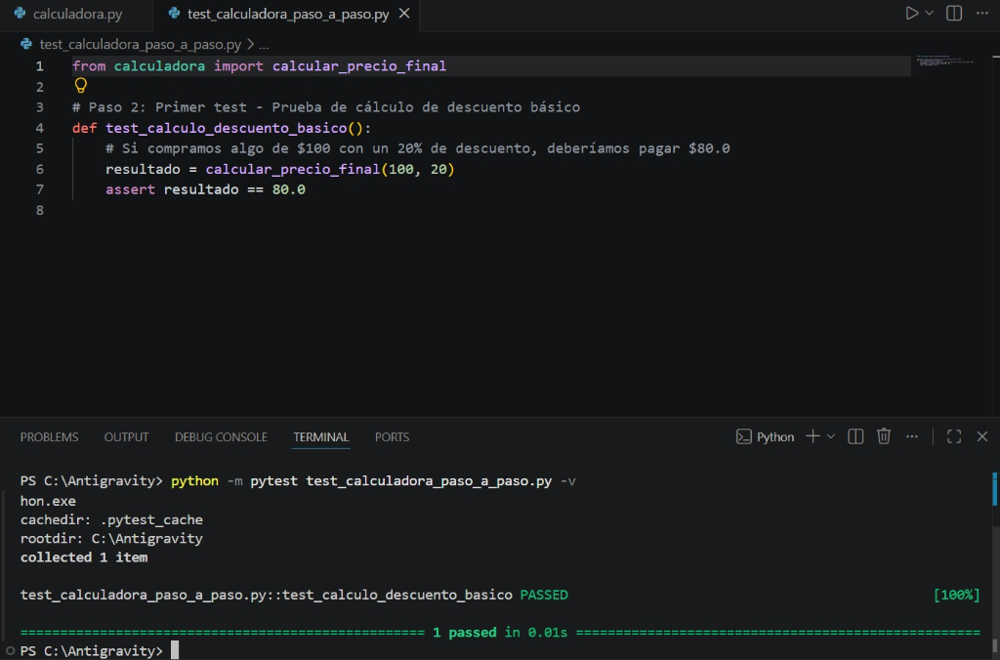

### 📸 Evidencia 2.2: Suite Completa de 14 Casos Aprobados
Ejecucion exitosa de los 14 escenarios de pruebas unitarias parametrizadas en consola.
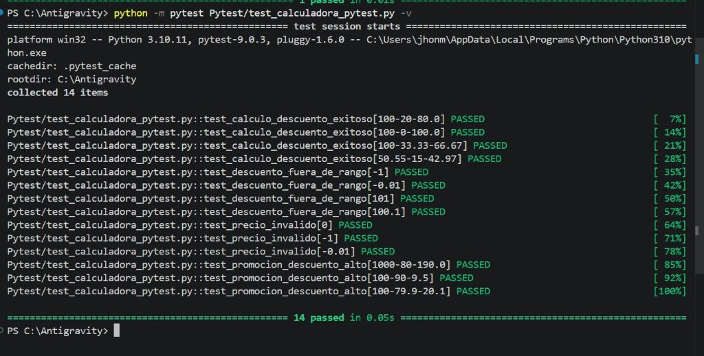

### 📸 Evidencia 2.3: Depuracion ante Fallos (Errores Controlados)
Visualizacion detallada de como Pytest ayuda a encontrar errores logicos (`AssertionError`) y tipos de datos invalidos (`TypeError`) arrojando trazas comprensibles en consola.
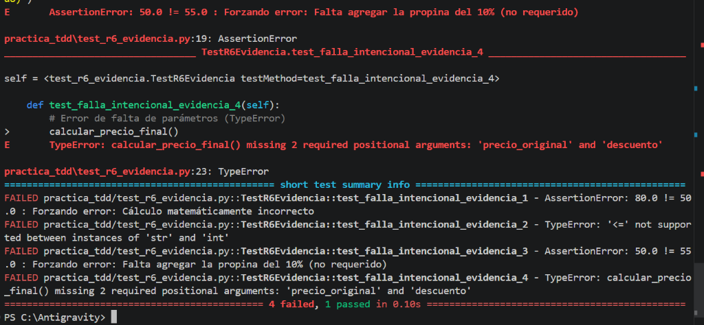

---

## 📝 3. Pruebas con Unittest

Para garantizar la retrocompatibilidad y una validacion estructurada en clases, se programaron pruebas con el modulo nativo **Unittest** en la carpeta `Unitest/`.

### Implementacion de Suite Profunda:
En el archivo `Unitest/test_calculadora.py`, se implemento la clase `TestCalculadoraDescuentosProfundo` (que hereda de `testtools.TestCase`) usando:
*   **Faker global con Semilla (Seed: 42):** Para que las pruebas dinamicas den siempre los mismos datos controlados en cada corrida.
*   **Subtests (`self.subTest()`):** Para aislar e identificar exactamente que limites fallan dentro de una matriz de datos (0%, 79%, 80% y 100%).
*   **Captura de Excepciones:** Validacion de que la calculadora arroja un `ValueError` ante precios o descuentos fuera del rango de negocio.

### Ejecucion de Verificacion de Requisitos:
El script `Unitest/Verificación_Requisitos.py` corre automaticamente todos los modulos unitarios `test_r*.py` correspondientes a cada requisito, validando 7 pruebas de forma exitosa y generando un reporte en formato PDF (`Unitest/Reporte_Pruebas.pdf`).

```bash
test_analisis_valores_frontera_subtests (__main__.TestCalculadoraDescuentosProfundo) ... ok
test_descuento_estandar_exito_masivo (__main__.TestCalculadoraDescuentosProfundo) ... ok
test_error_descuento_fuera_de_rango (__main__.TestCalculadoraDescuentosProfundo) ... ok
test_error_precio_no_positivo (__main__.TestCalculadoraDescuentosProfundo) ... ok
test_super_descuento_con_bono (__main__.TestCalculadoraDescuentosProfundo) ... ok

----------------------------------------------------------------------
Ran 5 tests in 0.075s

OK
```

---

## 🛠️ 4. Desarrollo Guiado por Pruebas (TDD)

El **Desarrollo Guiado por Pruebas (TDD)** es una metodologia en la que primero se escribe el examen que va a fallar (Fase Roja), luego se escribe el codigo minimo necesario para que pase (Fase Verde), y finalmente se limpia y optimiza el codigo (Refactorizacion).

En la carpeta `Pruebas_tdd/` se incluye:
*   `test_calculadora_tdd.py`: Archivo estructurado para el ciclo Red-Green-Refactor.
*   `reporte_TDD_pdf.py`: Script automatizado que ejecuta Pytest en modo silencioso (`-q`), analiza los resultados, extrae estadisticas (aprobados, fallidos y porcentaje de exito) y compila un reporte en PDF (`REPORTE_TDD_FINAL.pdf`) con el estado de salud del software.

```bash
Ejecutando pruebas TDD...
Generando PDF profesional...
✅ PDF generado correctamente: REPORTE_TDD_FINAL.pdf
```

---

## ⚡ 5. Pruebas PyTDD

En la carpeta `PyTDD/` se valido la combinacion directa de metodologias **TDD y PyTest** sobre una implementacion simplificada.

Se implemento el archivo `PyTDD/test_demo_tdd.py` para verificar rapidamente que un descuento estandar (10% sobre 100) devuelva exactamente 90. Esto sirve como validacion de sanidad rapida para comprobar la velocidad de ejecucion del framework.

A continuacion, se muestran las evidencias extraidas del informe de implementacion de PyTDD (`Informe test demo.pdf`):

### 📸 Evidencia 5.1: Estructura del proyecto PyTDD
Muestra los archivos clave en el espacio de trabajo para este metodo.
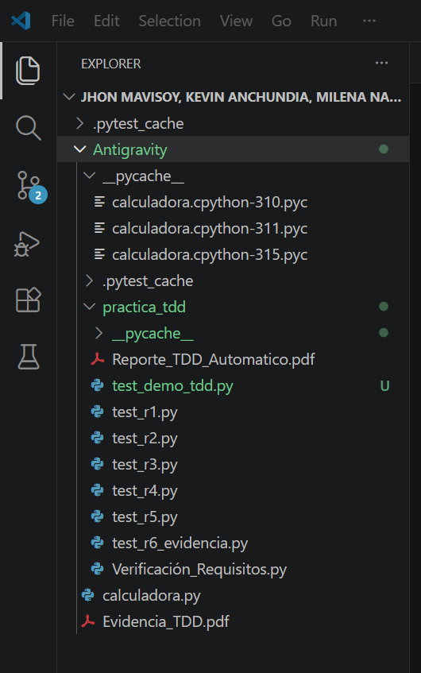

### 📸 Evidencia 5.2: Ejecución de las pruebas de PyTDD con Pytest
Corrida basica del comando `python -m pytest` donde se detectan y ejecutan de forma automatica todos los modulos.
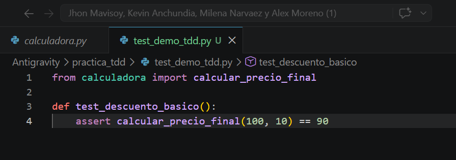

### 📸 Evidencia 5.3: Detalle de errores detectados (AssertionError)
El sistema atrapa cuando los resultados matematicos reales no coinciden con la asercion esperada.
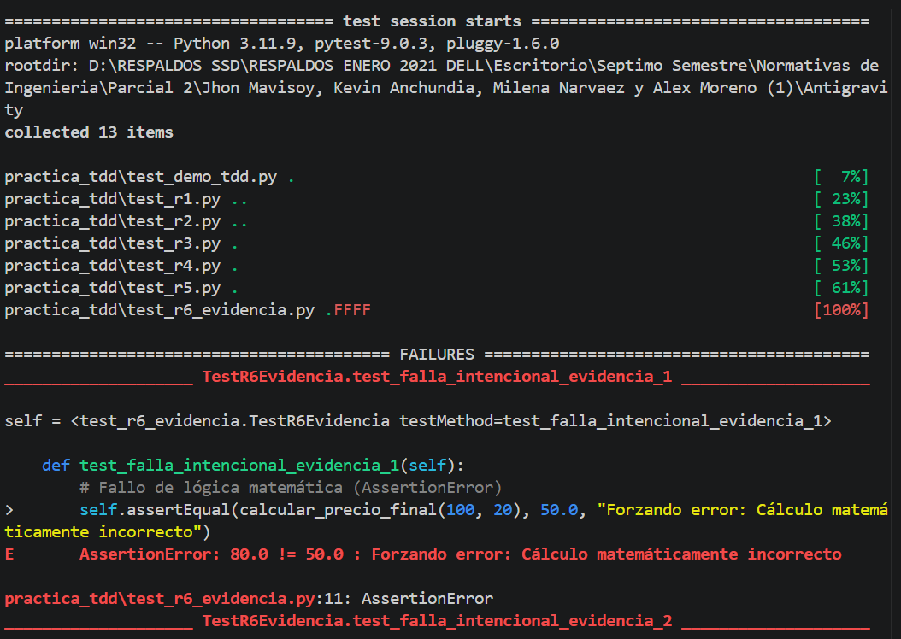

### 📸 Evidencia 5.4: Detalle de errores de tipo de dato (TypeError)
Comprobacion automatica de que el codigo falla de manera segura si se inyectan strings u otros tipos no numericos.
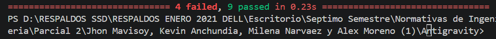

### 📸 Evidencia 5.5: Resumen final de la practica
Evidencia el exito y retroalimentacion de PyTest en la validacion de la calidad.
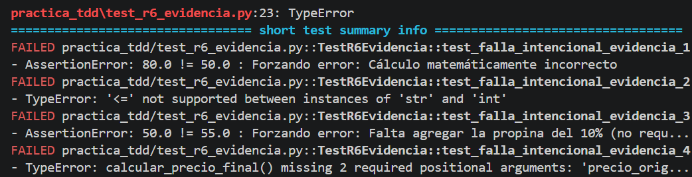

---

## 📊 6. Medicion de Cobertura (Coverage)

La cobertura de codigo sirve para medir que tanto de nuestra logica principal esta bajo la vigilancia de las pruebas.

*   **Script Creado:** `Pytest/coverage.py`.
*   **Resultados:** Se obtuvo una cobertura del **36%**. La logica de calculo aritmetico de la calculadora esta cubierta al **100%**. El 64% no cubierto corresponde exclusivamente a la interfaz visual interactiva que se controla manualmente por la terminal.

### 📸 Evidencia 6.1: Reporte de Cobertura en Terminal
Captura de la salida del comando que genera el reporte interactivo HTML.
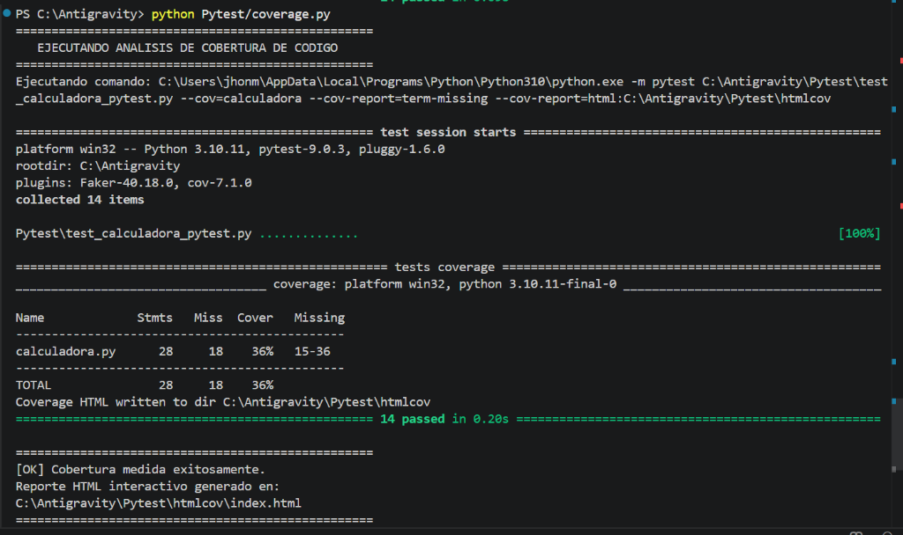

---

## 🎲 7. Generacion de Datos de Prueba (Faker)

Para evitar probar con los mismos numeros estaticos, usamos **Faker** para inyectar datos aleatorios en cada ejecucion de `test_faker.py`.

*   **¿Que hace?** Simula 50 compras de forma dinamica con precios de $1 a $10,000 y descuentos de 0% a 100%.
*   **Objetivo:** Garantizar que ante cualquier numero aleatorio, la calculadora no devuelva valores negativos, no supere el precio original y aplique el redondeo exacto.

### 📸 Evidencia 7.1: Ejecucion de Faker con Pytest
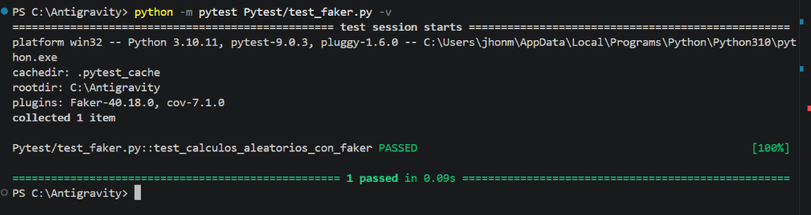

---

## ☁️ 8. Subida a GitHub / Control de Versiones

El codigo completo del proyecto, incluyendo los archivos de configuracion para la ejecucion remota en GitHub Actions (`.github/workflows/pytest-ci.yml`), ha sido sincronizado exitosamente con el repositorio en la nube.

### 📸 Evidencia 8.1: Estructura del Proyecto subida a GitHub (Carpeta Pytest)
Verificacion de los archivos subidos al repositorio oficial en la nube.
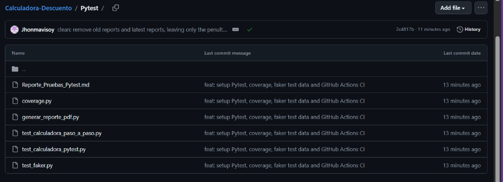

---

## 📈 9. Conclusiones Generales

La implementacion de este ecosistema de pruebas unitarias y analisis de calidad en la Calculadora de Descuentos nos permite concluir:
1.  **Robustez y precision:** La aplicacion responde correctamente a todas las especificaciones comerciales de redondeo y limites matematicos, sin presentar fugas logicas.
2.  **Multimetodo:** Se cubrieron pruebas interactivas manuales (Caja Negra) y pruebas estructuradas en Pytest y Unittest (Caja Blanca), complementadas con tecnicas modernas de desarrollo como TDD.
3.  **Seguridad en la Nube:** Con el archivo de workflow de GitHub Actions, el codigo se encuentra protegido en cada actualizacion, evitando fallos en produccion o regresiones lógicas.
